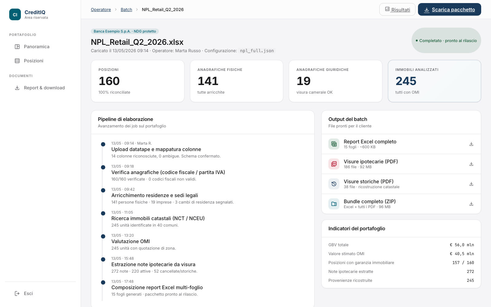
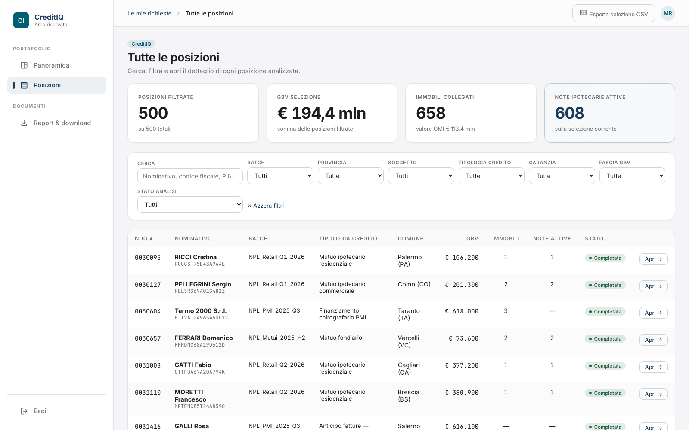

# CreditIQ · case study

CreditIQ is a production platform for the analysis of non-performing loan (NPL/UTP) portfolios that I designed, built and operate end to end. The codebase is private because it processes confidential credit data; this repository documents the architecture and the engineering decisions. All screenshots come from the synthetic demo dataset ("Banca Esempio"): no real data appears anywhere in this repo.

## The problem

A servicer or investor receives a datatape: an Excel file with hundreds of debt positions, each tied to people, companies and properties. Turning that into a priced, verified portfolio means checking every debtor against public registries, verifying every property in the land registry, reading notarial deeds, and keeping the whole process auditable. Done by hand it takes weeks per portfolio.

## What CreditIQ does

Upload a datatape, and the platform normalizes it into positions, entities and assets, then runs the verification pipeline automatically: VAT and fiscal-code analysis, cadastral checks, property valuation, and AI-assisted parsing of mortgage notes and deeds. Analysts review results in a web portal with per-position drill-down; everything is tracked through explicit analysis states so a portfolio's progress is always visible.

## Architecture

A Rust monolith organized as a Cargo workspace with an MVC split:

```
API server (Axum) ──> PostgreSQL job queue (Apalis) ──> background workers
      │                                                       │
   HTMX/Askama templates                        external registries · geocoding
      │                                                       │
      └────────────────── PostgreSQL (SQLx, 47 migrations) ───┘
```

| Crate | Role |
|---|---|
| `npl-model` | database models, repositories, external API clients |
| `npl-workers` | job handlers, workflows, business logic |
| `npl-api` | HTTP routes and server-rendered HTMX views |
| `npl-shared` | common types, validators, crypto |
| `mock-api-server` | mock of every external API for offline development and tests |

Numbers: ~120k lines of Rust across ~270 files, 47 SQL migrations, multi-tenant from the ground up.

## Engineering decisions worth explaining

- **PostgreSQL as the job queue** (Apalis): one database for state and jobs means transactional job enqueueing and no separate broker to operate. Analysis steps move through explicit states (`pending > submitted > polling > completed / error`), including a `waiting_for_dependency` state so a property check can wait for the debtor check that feeds it.
- **Server-rendered HTMX instead of a SPA**: the portal is forms, tables and drill-downs; HTMX keeps it fast, keeps all authorization server-side, and removed an entire frontend build from the operational surface.
- **AI parsing with a fallback chain**: mortgage notes and deeds are semi-structured scans. A multi-provider pipeline extracts parties, amounts and property identifiers, with every extraction stored next to its source for human verification: AI output is treated as a draft, never as truth.
- **Mock-first integrations**: every external registry has a mock implementation, so the full pipeline runs in CI and demos run on synthetic data by construction.
- **Boring, restorable operations**: single VPS, systemd, scripted deploys, secrets outside the repository, tested backups.

## Status

Live, with a client-facing demo environment. Solo project: product design, backend, frontend, infrastructure and operations.

## Screenshots

From the synthetic demo tenant ("Banca Esempio"): every name, fiscal code and amount is generated.

*Batch processing pipeline, from datatape upload to the client-ready report bundle:*



*Portfolio positions with per-position drill-down:*


